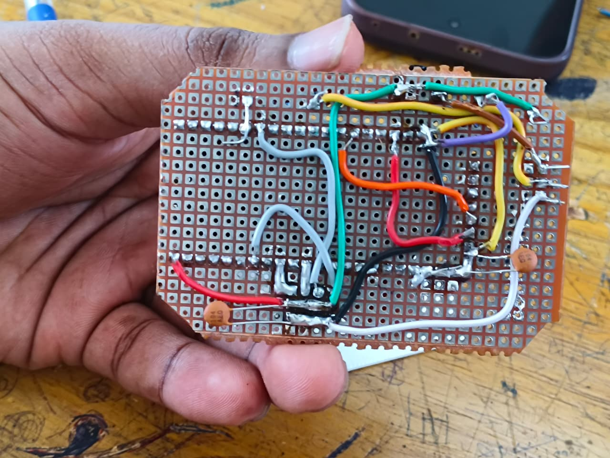
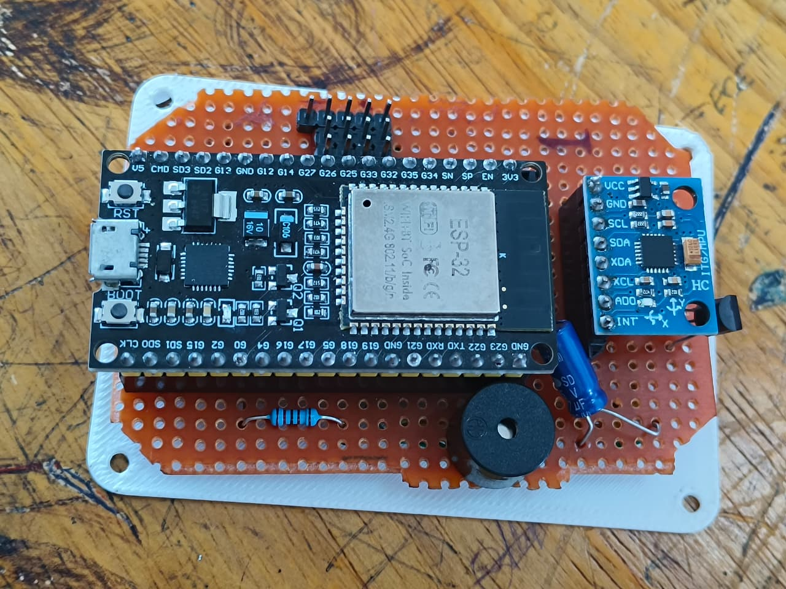

# Drone Internship Log - Day 2

## Flight Dynamics & Control Systems

### Altitude Control
Altitude defines the height at which the drone flies. To maintain or change altitude, the drone balances thrust against gravitational force:
* **Thrust > Weight:** The drone accelerates upward.
* **Thrust < Weight:** The drone descends.
* **Thrust = Weight:** The drone hovers stably in place.

### Pitch, Roll, and Yaw
* **Pitch:** Forward and backward tilt, controlling longitudinal movement.
* **Roll:** Left and right tilt, controlling lateral movement.
* **Yaw:** Rotational movement around the vertical axis, controlling heading direction.

### Resultant Moments
When thrust forces among the motors are unequal, rotational moments are generated. These moments allow the drone to tilt, roll, or change direction. If forces across all motors are perfectly symmetrical, the drone ascends straight up or hovers.

---

## Signal Processing & Hardware Architecture

### Signal Amplification via ESC
Microcontrollers like the ESP32 provide low-power digital control signals that cannot directly drive Brushless DC (BLDC) motors. The Electronic Speed Controller (ESC) acts as an amplifier, converting these logic-level control signals and raw battery power into a high-current, 3-phase AC output required to spin the motors.

### MOSFET Architecture Inside an ESC
A standard 3-phase ESC generally contains **6 MOSFETs**. Each of the 3 motor phases requires a half-bridge inverter circuit consisting of:
* One high-side MOSFET
* One low-side MOSFET

$$\text{3 Phases} \times \text{2 MOSFETs/Phase} = \text{6 MOSFETs}$$

These MOSFETs switch rapidly to modulate the frequency and amplitude of the 3-phase signal, controlling the BLDC motor's speed.

---

## Sensor Fusion & Navigation

### IMU (Inertial Measurement Unit)
The IMU is the core sensory system for stabilizing flight, housing both a gyroscope and an accelerometer built on **MEMS** (Micro-Electro-Mechanical Systems) technology.
* **Gyroscope:** Measures rotational angular velocity.
* **Accelerometer:** Measures linear acceleration and gravitational orientation.

### The Sensor Drift Problem
Both sensors are prone to cumulative errors over time (drift):
* **Gyroscope Drift:** Minor measurement bias accumulates over time, causing the calculated orientation to slowly drift away from true values.
* **Accelerometer Drift:** Highly sensitive to structural vibrations and sudden movements, introducing high-frequency noise.

To overcome this, flight controllers implement **Sensor Fusion** algorithms (such as Complementary or Kalman filters) to combine data from both sensors, canceling out individual drift and ensuring accurate orientation tracking.

### Telemetry
Telemetry establishes a real-time radio communication link between the drone and the ground control station (GCS) or transmitter. It continuously streams critical flight telemetry including flight variables, sensor outputs, battery voltage profiles, and GPS coordinates.

---

## Drone Regulations & Future Trends

### Regulations in India (DGCA Drone Rules 2021)
* **Nano Drones (<250g):** Do not require formal registration.
* **Micro Drones & Above:** Mandatorily require a Unique Identification Number (UIN) and a valid Pilot ID.
* Operations are strictly restricted inside designated No-Fly Zones (Red Zones).

### Future Upgrades: SLAM
**SLAM** (Simultaneous Localization And Mapping) enables autonomous drones to map unknown environments and navigate intelligently within them simultaneously, reducing total dependency on GPS systems for positional tracking.

---

## Flight Controller Circuit Components

### Core Controller
* **ESP32 (38-Pin Layout):** Serves as the primary microcontroller brain running the flight control loops.

### Passive Components
* **Ceramic Capacitor (104):** Used for decoupling and suppressing high-frequency switching noise. 
  $$\text{Code 104} = 10 \times 10^4 \text{ pF} = 100 \text{ nF} = 0.1\ \mu\text{F}$$
* **Electrolytic Capacitor (47µF, 35V):** Provides bulk energy storage for voltage smoothing and power rail stabilization.
* **Resistors:** Deployed across the board for current limiting, pull-up/pull-down configurations, and transistor biasing.

### Sensor & Interface Pin Mapping
The **MPU6050** IMU utilizes an $I^2C$ communication bus mapped to the following ESP32 pins:
* `GPIO 22` $\rightarrow$ **SCL** (Serial Clock)
* `GPIO 21` $\rightarrow$ **SDA** (Serial Data)
* `3.3V` $\rightarrow$ **VCC**
* `GND` $\rightarrow$ **GND**

*Extended MPU6050 Pins Note:* VCC, GND, SCL, SDA, XDA, XCL, ADD, INT.

### Actuator Output Mapping (ESCs)
* `GPIO 27` $\rightarrow$ Motor 1
* `GPIO 25` $\rightarrow$ Motor 2
* `GPIO 4`  $\rightarrow$ Motor 3
* `GPIO 12` $\rightarrow$ Motor 4
* *Physical Interface:* Connected via a $3 \times 4$ male header pin matrix.

### Resistor Color Code Calculations
* **Example 1:** Red, Red, Black, Brown, Brown
  $$220 \times 10^1 \ \Omega = 2.2\text{ k}\Omega \ (\pm 1\%)$$
* **Example 2:** Red, Red, Black, Red, Brown
  $$220 \times 10^2 \ \Omega = 22\text{ k}\Omega \ (\pm 1\%)$$

### Buzzer Driver Circuit
A buzzer status alarm cannot be driven directly by an ESP32 pin due to current limitations. A **BC557B PNP Transistor** is used as an electronic switch:
* **Control Path:** `GPIO 0` $\rightarrow$ $2.2\text{ k}\Omega$ Current-Limiting Resistor $\rightarrow$ **Base (B)**
* **Power Path:** **Emitter (E)** connected to `GND`.
* **Output Path:** **Collector (C)** connected to the negative terminal of the buzzer.
* The positive terminal of the buzzer is tied across the supply lines parallel to a $47\ \mu\text{F}$ filtering capacitor to damp switching audio spikes.

---

## Session Photos

### Prototype Testing & Wiring

### Flight Controller Circuit Layout (Top View)

