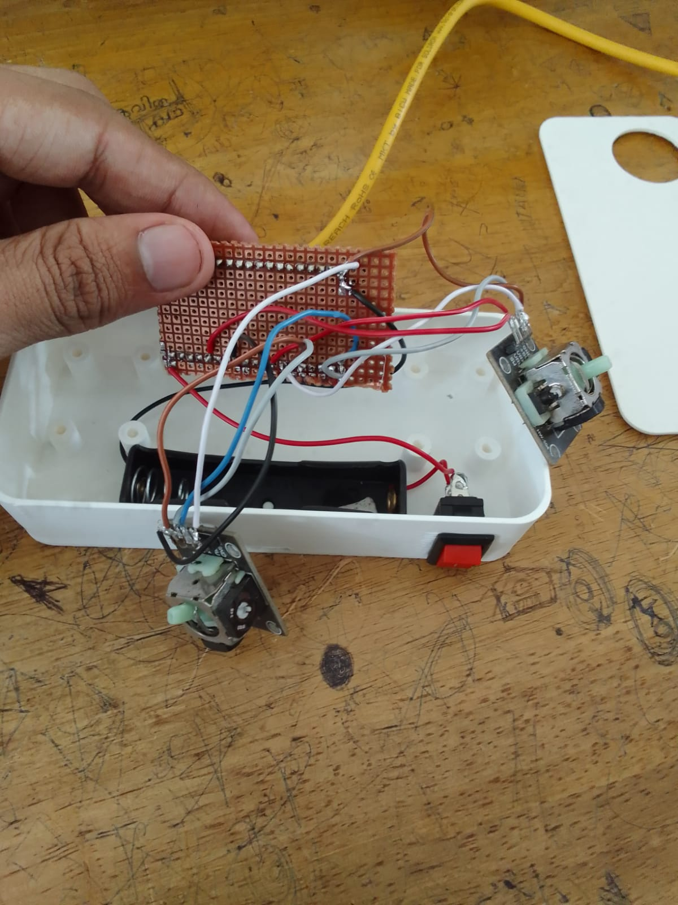

# Day 3 Documentation — Drone Internship
## Flashing, Testing, and Building the Drone Transmitter System Using ESP32

* **Internship Provider:** Nuke Labs
* **Location:** Government Engineering College, Thrissur (in collaboration with ISTE GECT Students' Chapter)

---

## 1. Objective of Day 3
The primary objectives of the third day focused on bridging embedded systems theory with physical drone hardware implementation:
* Verify all hardware connections using a multimeter.
* Flash open-source firmware into the ESP32-based flight controller.
* Understand the core mechanics of flight controller configuration.
* Test and verify sensor orientation using Betaflight Configurator.
* Build a DIY drone transmitter using an ESP32 and dual-axis joystick modules.
* Learn RC channel mapping and GPIO assignments.

---

## 2. Continuity Testing Using a Multimeter
Before applying power to the circuit, we conducted thorough continuity testing using a multimeter set to **Continuity Mode**.

### Why Continuity Testing is Critical
In custom-soldered electronics, faults such as broken trace wires, cold solder joints, or accidental short circuits can permanently damage components. Continuity testing verifies:
1. Whether two specific points are correctly electrically connected.
2. Whether the structural soldering is solid and continuous.

### Testing Methodology
We placed the two probes of the multimeter across critical connection points (e.g., `ESP32 GPIO pin` $\rightarrow$ `transistor pin`, `sensor VCC` $\rightarrow$ `power rail`, and common `GND` lines).
* **Beep Sound:** The connection path is continuous and correct.
* **No Beep Sound:** The path is broken, disconnected, or high-resistance.

> 💡 **Key Takeaway:** Continuity testing is the first and most critical debugging step in hardware development before initial power-up.

---

## 3. ESP32 Flight Controller Firmware Flashing

### What is Firmware?
Firmware is the foundational low-level software stored directly inside a microcontroller's non-volatile flash memory. In this architecture, the ESP32 serves as the primary processing unit ("brain") of the flight controller, driving:
* High-speed sensor data polling (IMU).
* Real-time stabilization calculations (PID loop).
* Motor output signal generation (PWM/DSHOT).
* Wireless communication protocols.

### Open-Source Flight Controller Firmware: ESP-FC
We utilized [ESP-FC](https://github.com/rtlopez/esp-fc), an open-source, ESP32-based drone flight controller firmware project developed by *rtlopez*.

**Core Features of ESP-FC:**
* Native support for ESP32 architectures.
* Compatible with MPU6050 and MPU9250 IMU sensors.
* Supports advanced ESC protocols like PWM and DSHOT.
* Fully compatible with Betaflight Configurator protocols.
* Integrated telemetry, WiFi, and low-latency ESP-NOW communication.

---

## 4. Flashing Procedure via ESP Tool
To upload the firmware binary onto the ESP32, we utilized **ESP Tool JS**, a robust browser-based serial flashing utility.

### Step-by-Step Execution:
1. **Download Firmware:** Downloaded the compiled firmware architecture `.zip` from the [ESP-FC Releases](https://github.com/rtlopez/esp-fc/releases) section and extracted the `.bin` file.
2. **Hardware Connection:** Connected the ESP32 development board to the laptop via a data-capable USB cable.
3. **Initialize Utility:** Opened the ESP Tool JS interface, clicked **Connect**, and selected the corresponding virtual COM port.
4. **Flash Configuration:** Loaded the firmware `.bin` target file and set the Flash Starting Address to `0x00`.

### Technical Terms Explained
* **Flash Address `0x00`:** This is the base index (starting memory address) of the ESP32's flash storage space. Specifying this ensures the bootloader knows exactly where to read the executable firmware.
* **Baud Rate:** This defines the raw communication speed (bits per second) over the serial bus between the host machine and the ESP32. We configured this to a standard **115200 baud**. While higher rates (e.g., 921600) speed up flashing, lower rates minimize transmission noise and sync errors.

---

## 5. Flight Controller Testing via Betaflight
Post-flashing, the device's stability performance was analyzed through the [Betaflight Configurator](https://betaflight.com/).

### Observations & Verification
Upon establishing a serial connection with the software, a real-time 3D rendering of a drone became visible. Manipulating the physical ESP32 controller matched the exact pitch, roll, and yaw actions on-screen. This success confirmed:
1. The **MPU6050 IMU sensor** was communicating cleanly over $I^2C$.
2. The onboard gyroscope and accelerometer data streams were being correctly parsed by the firmware.

---

## 6. Building the Drone Transmitter
The transmitter system maps operator joystick movements to control telemetry sent to the drone.

### Bill of Materials (BOM)
* **Microcontroller:** LOLIN32 ESP32
* **Inputs:** 2x HW-504 2-Axis Joystick Modules
* **Switches:** 1x SPST Toggle Switch
* **Power:** 3.7V 2600mAh Lithium-Ion Battery
* **Prototyping:** Perfboard & high-grade jumper wires

### Hardware Peripheral Pinouts

#### Joystick 1: Roll / Pitch
| Function | Pin Type | Assigned GPIO |
| :--- | :--- | :--- |
| **Roll** | Analog Input | GPIO 32 |
| **Pitch** | Analog Input | GPIO 33 |
| **Switch** | Digital Input | GPIO 13 |

#### Joystick 2: Throttle / Yaw
| Function | Pin Type | Assigned GPIO |
| :--- | :--- | :--- |
| **Throttle** | Analog Input | GPIO 34 |
| **Yaw** | Analog Input | GPIO 35 |
| **Switch** | Digital Input | GPIO 14 |

#### Auxiliary Inputs & System Power
| Component/Function | Target Connection / GPIO |
| :--- | :--- |
| **ARM (AUX1)** | GPIO 25 |
| **AUX2** | GPIO 26 |
| **ESP32 Power Input** | Battery 5V Boost Rail |
| **Joystick VCC** | ESP32 3.3V Output Rail |
| **Common Ground** | GND Bus |

### RC Channel Map Configuration
To ensure standard interface communications, the following RC channel mapping was configured:

